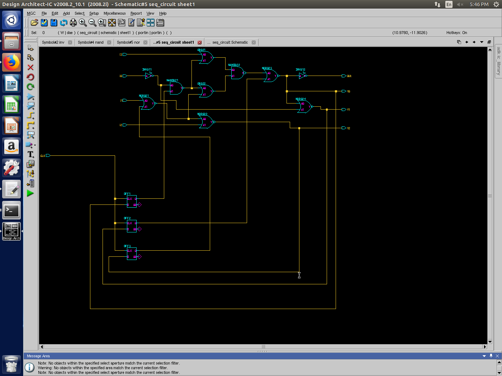

# EECS315 Lab 3 Report
**Andrea Norris** (adn33@case.edu)
## Introduction 

The purpose of this lab is to simulate both a sequential circuit and a 4x4 Multiplier using Design Architect IC

## Problem 1

Problem 1 focused on designing a registered combinational circuit to practice timing analysis on. We were expected to use the worst case rise and fall times for each of the gates from lab 2 to compute the longest sensitizable in the circuit. To construct this schematic, I used Nand, Nor, and Inverter gates constructed in lab 2, as well as a remade D Flip-Flop. An image of the final schematic is attached below.
 

Some difficulties were had in constructing this schematic. Due to the nature of the lab computer's file systems, the D Flip-Flop file from Lab 2 was lost. I ultimately used one of the premade D Flip-Flops provided by the program. In addition, an OAI was needed to complete this schematic, which I did not have since Lab 2 had us create an AOI. Again, I used the provided OR gates to complete the schematic as shown. 

Waveform generation failed, as over 200 errors were generated. The errors stated that the gates provided by the program were not defined. I worked with many of my classmates in an attempt to resolve this error but we were unsuccessful.  

The critical path for this circuit would be the path with the most gates to traverse, as each gate would have similar time delays, with the exception of inverters which are less. The longest path would be through the following gates: A, C, D/E, G, H, J. 

Clock time cycle: The clock time cycle should be at least as long as the sum of the gate delay of the longest path, to prevent any setup/hold time violations. The gate delay is equal to the sum of the time taken for the gate to transition from low to high and the transition time from high to low. For this circuit, it would be Tg for 2 AND + 1 OR + 2 NOR + 1 INV. 

Setup/Hold time violations: Since I was unable to generate waveforms, I was unable to confirm my calculations of fastest clock time cycle.

## Problem 2
This problem had me design a 4x4 multiplier using the shift add structure given. To complete this task, I had to create many schematics. The entire schematic is attached below, with following closeups of individual parts.

The first schematic that had to be created was the 4 bit parallel in - parallel out registers. The schematic was created as follows, using D Flip-Flops from the program:

The next schematic that had to be created was the 4 bit adder. I made a Ripple Carry Adder, composed of Full Adder modules that were in turn composed of Half Adder modules. The breakdown of each of these schematics is below.

Half Adder:

Full Adder:

4-bit Adder:

All gates used were from the DA-IC's libraries.

The final schematic that had to be created was the 2-1 Multiplexer. It's schematic is below.

The overall schematic can be viewed more closely in the following two images.

Again, difficulties were had in generating waveforms for the 4x4 Multiplier, due to lack of definition of gates provided in the program libraries. These errors were not resolved despite the efforts of multiple students. 

Critical path: The critical path for a multiplier is a more difficult question. For this instance, we will assume the discussion is regarding critical path for the multiplier when one input is given and not interrupted until output is generated. The critical path should be one with a large amount of carries, such as 16 being multiplied by another number. All numbers traverse similar paths however, so the difference between operations shoudld be minimal. There might be an observable time difference between a process such as multiplying 0 x 0 and multiplying 15 x 15. 0 x 0 would utilize few pmos transistors in favor of nmos, which have a slightly shorter delay, whereas 15 x 15 initially has all 1's, which pass through pmos transistors and have a slightly longer delay.

Critical path delay: The critical path delay is also difficult to compute. In my design, it would be the delay of 12 multiplexers, 3 4-bit registers, and a 4-bit adder, all multiplied by the 4 clock cycles.  For the 4-bit adder, I calculate the delay time to be 4*(2*AND+OR). I calculate the delay for each multiplexer to be INV + AND + OR. I calculate the delay for one 4-bit register to be the delay of one D Flip - Flop. 

Setup/Hold time violation: I was unable to determine if there was a setup / hold time violation due to an inability to generate waveforms. 

Is the time cycle optimal?
I imagine any time cycle I calculate would not be optional, since I don't have enough experience to verify optimality. 

##Conclusions
During this lab, I learned how to work through the design process of a digital clocked circuit, based on basic parameters and a simple structure. Although I need more practice determining path delays and optimal clock cycles, I believe I have a better understanding of how the design process works. I also gained a better understanding of how to work with Design Architect IC, although I could benefit from time spent with a more experienced user of the program to optimixe my skills and become more proficient at debugging errors. 

 

